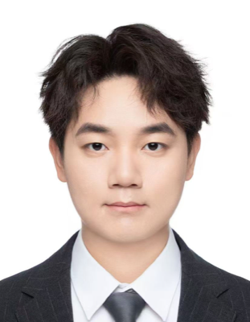
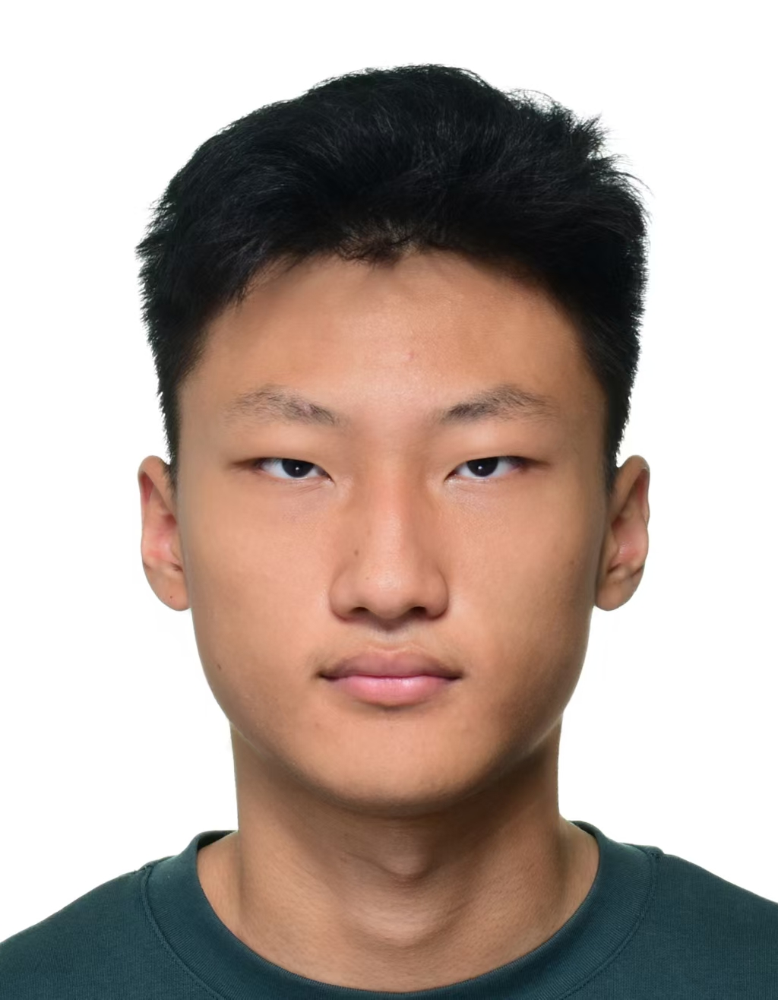
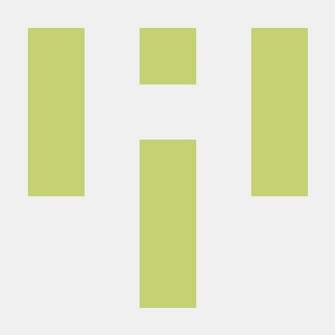
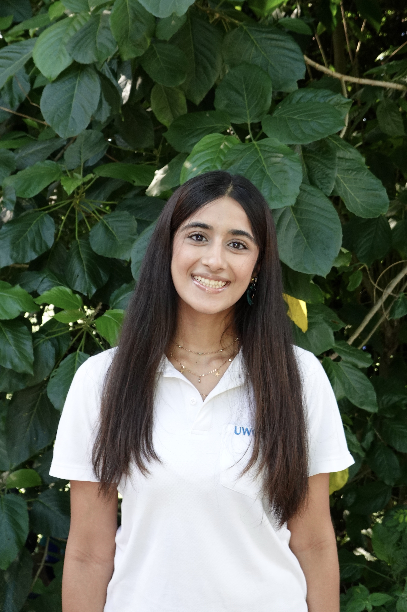

# About Us

We are a team based in the [School of Computing, National University of Singapore](https://www.comp.nus.edu.sg).

You can reach us at the email `e1406390[at]u.nus.edu`

## Project team

### Joshua Andrew

[[github](https://github.com/joshmode)]

* Role: Maintainer and implementer
* Responsibilities: Maintaining the team repository, including the issue tracker, milestones and merging of pull requests, and implementing features

### Wang Kaiyuanhao

[[github](https://github.com/Lew1sWong)]

* Role: Developer
* Responsibilities: Implementing and testing assigned TutorFlow features, and maintaining related documentation.

### Terence Goh Yan Chen

[[github](https://github.com/notmeegoreng)]

* Role: Developer
* Responsibilities: Implementing and testing assigned TutorFlow features, and maintaining related documentation.

### Wang Xiaojie

[[github](https://github.com/IliekS)]
[[portfolio](team/ilieks.md)]

Year 3 Computer Science
* Role: Developer
* Responsibilities: Maintaining the team repository, including the issue tracker, milestones and merging of pull requests, and implementing features

### Thakker Yash

[[github](https://github.com/Yash-PoPularPlusPlus)]

* Role: Developer
* Responsibilities: Implementing and testing assigned TutorFlow features, and maintaining related documentation.

### Samaira Kapur

[[github](https://github.com/samairakapur)]
[[portfolio](team/samairakapur.md)]

* Role: TODO
* Responsibilities: TODO
