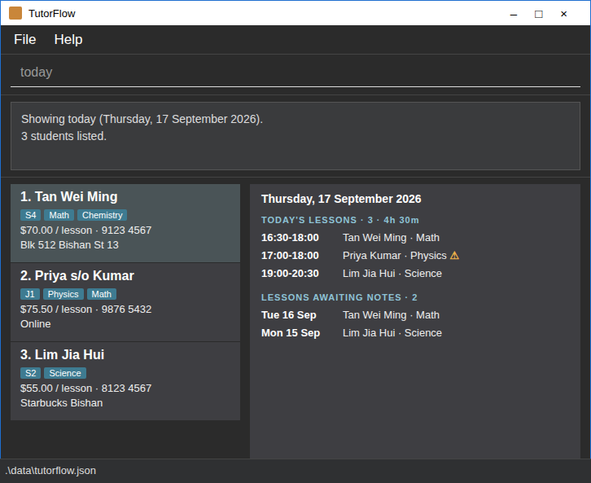

# TutorFlow User Guide
## This page is a work-in-progress
TutorFlow is a **desktop application that keeps your students, schedule, and payments in one place, optimized for use through a Command Line Interface (CLI)** while retaining the benefits of a Graphical User Interface (GUI).
For power-users, TutorFlow can help you manage your students and lessons faster than traditional GUI applications.

<!-- * Table of Contents -->
<page-nav-print />

--------------------------------------------------------------------------------------------------------------------

## Quick start

1. Ensure that Java `25` or later is installed on your computer.<br>
   **Mac users:** Ensure you have the precise JDK version prescribed [here](https://se-education.org/guides/tutorials/javaInstallationMac.html).

1. Download the latest `.jar` file from [here](https://this-is-a-placeholder).

1. Copy the file to the folder you want to use as the _home folder_ for TutorFlow.

1. Open a terminal, `cd` to the folder containing the JAR file, and run `java -jar addressbook.jar`.<br>
   A GUI similar to the one below should appear in a few seconds. Note how the app contains some sample data.<br>
   

1. Type a command in the command box and press Enter to execute it. For example, type **`help`** and press Enter to open the help window.<br>
   Some example commands you can try:

   * `list` : Lists all students.

   * `add n/John Doe p/98765432 l/S4 s/Math r/50` : Adds a student named `John Doe`, who is in Secondary 4, learns Math and pays $50 per lesson.

   * `delete 3` : Deletes the 3rd student shown in the current list.

   * `clear` : Deletes all students.

   * `exit` : Exits the app.

1. Refer to the [Features](#features) section below for details of each command.

--------------------------------------------------------------------------------------------------------------------

## Features

<box type="info" seamless>

**Notes about the command format:**<br>

* Words in `UPPER_CASE` are the parameters to be supplied by the user.<br>
  For example, in `add n/NAME`, replace `NAME` with a value such as `John Doe`.

* Items in square brackets are optional.<br>
  For example, `n/NAME [e/EMAIL]` can be used as `n/John Doe e/john@example.com` or as `n/John Doe`.

* Items followed by `...` can appear zero or more times.<br>
  For example, `s/SUBJECT...` can be written as `s/Math` or `s/Math s/Physics`.

* Items such as `week/` and `all/` are flags: write them on their own, without a value.<br>
  For example, `agenda week/` is accepted, but `agenda week/yes` is rejected.

* Parameters can be in any order.<br>
  For example, if the command specifies `n/NAME p/PHONE_NUMBER`, `p/PHONE_NUMBER n/NAME` is also acceptable.

* Extraneous parameters for commands that take no parameters, such as `help`, `list`, `today`, `exit`, and `clear`, are ignored.<br>
  For example, `help 123` is interpreted as `help`.

* If you are using a PDF version of this document, be careful when copying and pasting commands that span multiple lines as space characters surrounding line-breaks may be omitted when copied over to the application.
</box>

### Viewing help: `help`

Shows a message explaining how to access the help page.


Format: `help`


### Adding a student: `add`

Adds a student to TutorFlow.

Format: `add n/NAME p/PHONE_NUMBER l/LEVEL s/SUBJECT... r/RATE [e/EMAIL] [v/VENUE]`

* `NAME` is up to 100 characters of letters, digits, spaces and `. , ' ( ) / -`, such as `Tan Wei Ming (twin A)` or `Priya d/o Kumar`. Avoid typing a `/` right after a space when it would look like a prefix, such as `s/o`, because TutorFlow reads it as the start of the next parameter.
* `LEVEL` is one of `P1` to `P6` (primary), `S1` to `S5` (secondary) or `J1` to `J2` (junior college). It is not case-sensitive, so `s3` is the same as `S3`.
* `PHONE_NUMBER` has 3 to 15 digits and can start with `+`, for example `91234567` or `+6591234567`. Spaces and hyphens between the digits are allowed and are removed, so `9123 4567` is stored as `91234567`.
* `SUBJECT` is free text of up to 30 letters, digits, spaces, `&` and `-`, such as `Math` or `English & Literature`. Subjects are not case-sensitive.
* `RATE` is the amount charged per lesson in dollars, from `0` to `9999.99` with at most 2 decimal places. A leading `$` is accepted, so `50`, `50.00` and `$50` are the same rate.
* `VENUE` is where the student is usually taught, up to 100 characters.
* Extra spaces in a `NAME` are ignored, so `John  Tan` is stored as `John Tan`.
* Two students are duplicates if they have the same phone number and a name that matches when letter case and extra spaces are ignored. A duplicate is not added.
* Two different students can share a name, for example two students called `Tan Wei Ming` with different phone numbers. TutorFlow adds the student and shows a note, so that you can spot a double entry.

<box type="tip" seamless>

**Tip:** A student can have any number of subjects, but must have at least one. The email and the venue are optional.
</box>

Examples:
* `add n/John Doe p/98765432 l/S4 s/Math r/50`
* `add n/Betsy Crowe p/1234567 l/J1 s/Physics s/Chemistry r/62.50 e/betsycrowe@example.com v/Blk 123 Bishan St 13`

### Listing all students: `list`

Shows a list of all students in TutorFlow.

Format: `list`

### Editing a student: `edit`

Edits an existing student in TutorFlow.

Format: `edit INDEX [n/NAME] [p/PHONE_NUMBER] [e/EMAIL] [l/LEVEL] [s/SUBJECT]... [r/RATE] [v/VENUE]`

* Edits the student at the specified `INDEX`. The index refers to the index number shown in the displayed student list. The index **must be a positive integer** 1, 2, 3, ...
* At least one of the optional fields must be provided.
* Existing values will be updated to the input values.
* When editing subjects, all of the student's existing subjects are replaced; adding subjects is not cumulative. A student must keep at least one subject.
* The values for the level, subjects, rate and venue follow the same rules as for [`add`](#adding-a-student-add).
* If the edit gives the student the name of another student, it is accepted and TutorFlow shows a note. If the phone number is also the same as that student's, the edit is rejected as a duplicate.

Examples:
*  `edit 1 p/91234567 e/johndoe@example.com` Edits the phone number and email address of the 1st student to be `91234567` and `johndoe@example.com` respectively.
*  `edit 2 l/S4 s/Math s/Chemistry` Changes the 2nd student to Secondary 4, and the subjects to `Math` and `Chemistry`.

### Locating students by name: `find`

Finds students whose names contain any of the given keywords.

Format: `find KEYWORD [MORE_KEYWORDS]`

* The search is case-insensitive; for example, `hans` matches `Hans`.
* Keyword order does not matter; for example, `Hans Bo` matches `Bo Hans`.
* The search considers only names.
* A keyword matches any part of a name; for example, `Han` matches `Hans` and `Johan`, and `wei` matches `Tan Wei Ming`.
* A keyword can be up to 100 characters long.
* Students matching at least one keyword are returned (an `OR` search); for example, `Hans Bo` returns `Hans Gruber` and `Bo Yang`.

Examples:
* `find John` returns `john` and `John Doe`
* `find alex david` returns `Alex Yeoh`, `David Li`<br>
  

### Viewing a student's overview: `view`

Shows what you need to prepare for one student, on one screen.

Format: `view INDEX`

* Shows the student at the specified `INDEX`.
* The index refers to the index number shown in the displayed student list.
* The index **must be a positive integer** 1, 2, 3, ...
* The overview shows, in this order:
  * the student's level, subjects, rate, phone number and, if recorded, email, usual venue and remark
  * the **next lesson**: the date, time, subject and venue of the first scheduled lesson from today onwards
  * the **recent lesson notes**: the notes of the 3 most recent completed lessons, newest first
  * the **lesson history**: how many lessons are completed, cancelled and missed
* A section with nothing to show says so, for example `No upcoming lessons.`, instead of disappearing.
* The command only shows information. It does not change the student list, so the indexes you use for other commands stay the same.

Examples:
* `list` followed by `view 2` shows the overview of the 2nd student.
* `find Betsy` followed by `view 1` shows the overview of the 1st student in the results of the `find` command.

### Deleting a student: `delete`

Deletes the specified student from TutorFlow.

Format: `delete INDEX [confirm]`

* Deletes the student at the specified `INDEX`.
* The index refers to the index number shown in the displayed student list.
* The index **must be a positive integer** 1, 2, 3, ...
* A student with no lessons is deleted immediately.
* Deleting a student also deletes **all of their lessons**, and this cannot be undone. If the student has any lessons, TutorFlow does not delete anything yet. It shows the student's name, phone number, number of lessons and, if there are any, a warning about upcoming lessons, and asks you to repeat the command with `confirm`.
* The keyword `confirm` is in lower case.

Examples:
* `list` followed by `delete 2` deletes the 2nd student, if they have no lessons.
* `delete 3` on a student with 12 lessons shows a prompt; `delete 3 confirm` then deletes the student and the 12 lessons.
* `find Betsy` followed by `delete 1` deletes the 1st student in the results of the `find` command.

### Sorting students by name: `sort`

Sorts all students by name, ignoring upper and lower case.

Format: `sort [asc|desc]`

* `asc` sorts from A to Z and `desc` sorts from Z to A. If no order is given, `asc` is used.
* All students are shown after sorting, even if the list was filtered by an earlier `find` command.
* The new order is saved, so the students stay in this order the next time you open the app.

Examples:
* `sort` sorts all students from A to Z.
* `sort desc` sorts all students from Z to A.

### Scheduling a lesson: `lesson add`

Schedules a lesson for a student.

Format: `lesson add st/STUDENT_INDEX [s/SUBJECT] d/DATE t/TIME [dur/MINUTES] [v/VENUE]`

* `STUDENT_INDEX` is the index number shown in the displayed student list, and **must be a positive integer** 1, 2, 3, ...
* `DATE` is written as `YYYY-MM-DD`, such as `2026-12-22`, or as `D/M/YYYY`, such as `22/12/2026`. It must be today or later, and no more than 2 years ahead, which catches a mistyped year.
* `TIME` is written in 24-hour time, such as `16:30`. `4:30pm` and `1630` are also accepted.
* `MINUTES` is the length of the lesson, from `15` to `480` in steps of `15`. If it is left out, it is `60`.
* `SUBJECT` must be one of the student's subjects, and is not case-sensitive. If the student has only one subject, it can be left out. If the student has several, it must be given.
* `VENUE` is up to 100 characters. If it is left out, the student's usual venue is used, or `—` if the student has none.
* A lesson must end on the day it starts, so `t/23:00 dur/120` is rejected. Split it into two lessons.
* Two lessons are duplicates if they have the same student, subject, date, time and duration. A duplicate is rejected.

<box type="warning" seamless>

**Overlaps only warn:** if the new lesson overlaps another scheduled lesson by at least one minute on the same date, it is still scheduled and the result lists the lessons it overlaps with. Lessons that end exactly when the next one starts do not overlap. Cancelled lessons are ignored.
</box>

Examples:
* `lesson add st/1 s/Math d/2026-12-22 t/16:30 dur/90` Schedules a 90-minute Math lesson for the 1st student at the student's usual venue.
* `lesson add st/2 d/2026-12-23 t/19:00 v/Online` Schedules a 60-minute lesson online for the 2nd student, in the only subject that student takes.

### Viewing the agenda: `agenda`

Shows the lessons of a day or of a week, in the order that they take place.

Format: `agenda [d/DATE] [week/]`

* Without `d/DATE`, it shows today. `DATE` is written as for [`lesson add`](#scheduling-a-lesson-lesson-add).
* With `week/`, it shows the Monday to Sunday week that contains the date, one day after another. A day without lessons shows `— no lessons —`.
* Each line shows the lesson number, the time, the student, the subject, the venue, and the status if the lesson is not simply scheduled. Lessons that overlap another lesson are marked `⚠ overlaps`.
* Cancelled lessons are listed but are not counted in the number of lessons and the total time.
* The lesson numbers are the ones that [`lesson move`](#rescheduling-a-lesson-lesson-move) and [`lesson cancel`](#cancelling-a-lesson-lesson-cancel) take, so run `agenda` or `lesson list` first and then use the number you see.
* A day without lessons is not an error: it shows `No lessons on Tue 22 Dec 2026.`

Examples:
* `agenda` Shows today's lessons.
* `agenda d/2026-12-22 week/` Shows the week of Monday 21 December 2026.

### Viewing today's dashboard: `today`

Shows what today requires: today's lessons, and the past lessons that are not yet marked completed.

Format: `today`

* The first section, `TODAY'S LESSONS`, shows the number of lessons today and their total time, followed by the time, student, subject and venue of each lesson. Lessons that overlap another lesson are marked `⚠ overlaps`. Cancelled lessons are left out.
* The second section, `LESSONS AWAITING NOTES`, shows the scheduled lessons from earlier days that were not marked completed, the most recent first.
* An empty section is not an error: it shows `No lessons today.` or `All past lessons are recorded.`
* Today is the date on your computer, so a wrong system clock shows the wrong day.

Examples:
* `today` on Thursday 17 September 2026 might show:
  ```
  Thursday, 17 September 2026

  TODAY'S LESSONS (2, 2h 30m)
    16:30-18:00  Tan Wei Ming       Math       Blk 512 Bishan St 13  ⚠ overlaps
    17:00-18:00  Priya s/o Kumar    Physics    Online  ⚠ overlaps

  LESSONS AWAITING NOTES (1)
    Tue 15 Sep  Lim Jia Hui        Science    not yet marked completed
  ```

### Listing the lessons of a student: `lesson list`

Shows the lessons of one student.

Format: `lesson list st/STUDENT_INDEX [all/]`

* `STUDENT_INDEX` is the index number shown in the displayed student list.
* By default, only upcoming lessons are shown, which means scheduled lessons from today onwards. With `all/`, past and cancelled lessons are shown as well.
* The lessons are numbered in date order. These are the numbers that `lesson move` and `lesson cancel` take.

Examples:
* `lesson list st/1` Shows the upcoming lessons of the 1st student.
* `lesson list st/1 all/` Shows every lesson of the 1st student.

### Rescheduling a lesson: `lesson move`

Moves a lesson to another date, time, duration or venue, and keeps everything else.

Format: `lesson move INDEX [d/DATE] [t/TIME] [dur/MINUTES] [v/VENUE]`

* `INDEX` is the lesson number in the list that is currently shown by `agenda` or `lesson list`, and **must be a positive integer** 1, 2, 3, ...
* At least one of the optional fields must be given. Fields that are not given stay as they were.
* The values follow the same rules as for [`lesson add`](#scheduling-a-lesson-lesson-add). A new date must be today or later. Only a date that you give is checked, so you can still change the time of a lesson that has already passed.
* A completed or cancelled lesson cannot be rescheduled.
* If the move makes the lesson identical to another lesson, it is rejected. If it makes the lesson overlap another lesson, it is moved and the result warns you.

Examples:
* `lesson move 1 d/2026-12-24` Moves the 1st lesson to 24 December 2026 at the same time.
* `lesson move 2 t/17:00 v/Online` Moves the 2nd lesson to 17:00 and changes its venue to `Online`.

### Cancelling a lesson: `lesson cancel`

Cancels a lesson but keeps its record, so that you can still see that the slot was booked.

Format: `lesson cancel INDEX [r/REASON]`

* `INDEX` is the lesson number in the list that is currently shown by `agenda` or `lesson list`.
* `REASON` is up to 200 characters on one line, such as `Student unwell`.
* The lesson stays in the agenda as cancelled and no longer overlaps other lessons.
* A lesson that is already cancelled or already completed cannot be cancelled.

Examples:
* `lesson cancel 1` Cancels the 1st lesson.
* `lesson cancel 3 r/Student unwell` Cancels the 3rd lesson and records the reason.

### Clearing all entries: `clear`

Clears all students and lessons from TutorFlow.

Format: `clear`

### Exiting the program: `exit`

Exits the program.

Format: `exit`

### Saving the data

TutorFlow automatically saves data after every command. You do not need to save manually.

### Editing the data file

TutorFlow data is saved automatically as a JSON file `[JAR file location]/data/addressbook.json`. Advanced users are welcome to update data directly by editing that data file.

Every lesson in the file must be with a student in the same file, with the same name and phone number. A file with a lesson whose student is missing is treated as invalid, as described below.

<box type="warning" seamless>

**Caution:**
If your changes make the data file invalid, TutorFlow starts with no students and lessons at the next run. The invalid file remains on disk until you run a command (TutorFlow saves after every command). Still, we recommend backing up the file before editing it.<br>
Furthermore, certain edits can cause TutorFlow to behave in unexpected ways (e.g., if a value entered is outside of the acceptable range). Therefore, edit the data file only if you are confident that you can update it correctly.
</box>

### Archiving data files `[coming in v2.0]`

_Details coming soon ..._

--------------------------------------------------------------------------------------------------------------------

## FAQ

**Q**: How do I transfer my data to another computer?<br>
**A**: Install the app on the other computer and overwrite the data file it creates with the data file from your previous TutorFlow home folder.

--------------------------------------------------------------------------------------------------------------------

## Known issues

1. **When using multiple screens**, if you move the application to a secondary screen, and later switch to using only the primary screen, the GUI will open off-screen. The remedy is to delete the `preferences.json` file created by the application before running the application again.
2. **If you minimize the Help Window** and then run the `help` command (or use the `Help` menu, or the keyboard shortcut `F1`) again, the original Help Window will remain minimized, and no new Help Window will appear. The remedy is to manually restore the minimized Help Window.

--------------------------------------------------------------------------------------------------------------------

## Command summary

Action     | Format, Examples
-----------|----------------------------------------------------------------------------------------------------------------------------------------------------------------------
**Add**    | `add n/NAME p/PHONE_NUMBER l/LEVEL s/SUBJECT... r/RATE [e/EMAIL] [v/VENUE]` <br> e.g., `add n/James Ho p/22224444 l/S3 s/Math s/Physics r/55 e/jamesho@example.com v/Online`
**Clear**  | `clear`
**Delete** | `delete INDEX [confirm]`<br> e.g., `delete 3`, `delete 3 confirm`
**Edit**   | `edit INDEX [n/NAME] [p/PHONE_NUMBER] [e/EMAIL] [l/LEVEL] [s/SUBJECT]... [r/RATE] [v/VENUE]`<br> e.g.,`edit 2 n/James Lee e/jameslee@example.com`
**Find**   | `find KEYWORD [MORE_KEYWORDS]`<br> e.g., `find James Jake`
**List**   | `list`
**View**   | `view INDEX`<br> e.g., `view 1`
**Sort**   | `sort [asc\|desc]`<br> e.g., `sort desc`
**Help**   | `help`
**Lesson add** | `lesson add st/STUDENT_INDEX [s/SUBJECT] d/DATE t/TIME [dur/MINUTES] [v/VENUE]`<br> e.g., `lesson add st/1 s/Math d/2026-12-22 t/16:30 dur/90`
**Agenda** | `agenda [d/DATE] [week/]`<br> e.g., `agenda d/2026-12-22 week/`
**Today** | `today`
**Lesson list** | `lesson list st/STUDENT_INDEX [all/]`<br> e.g., `lesson list st/1 all/`
**Lesson move** | `lesson move INDEX [d/DATE] [t/TIME] [dur/MINUTES] [v/VENUE]`<br> e.g., `lesson move 1 d/2026-12-24 t/17:00`
**Lesson cancel** | `lesson cancel INDEX [r/REASON]`<br> e.g., `lesson cancel 1 r/Student unwell`
